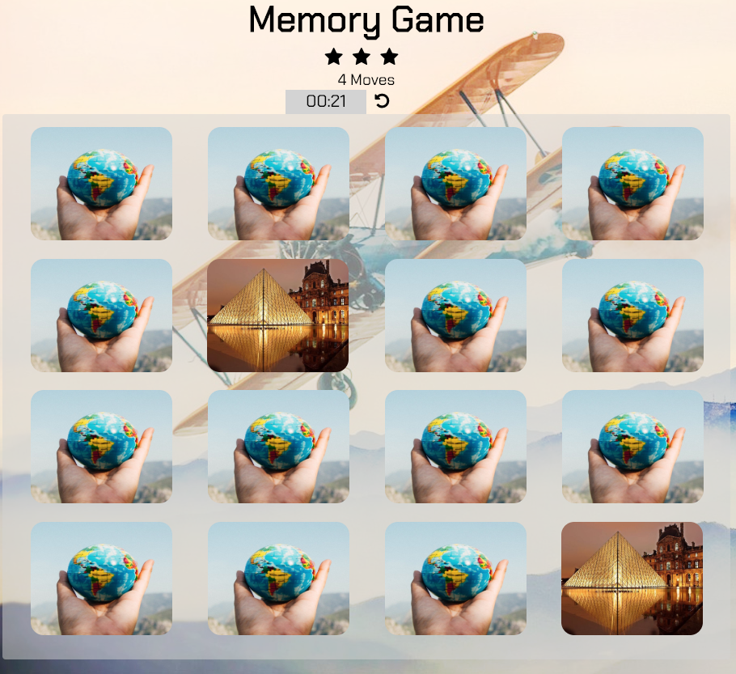

# Memory Game

## Table of Contents
- [Instructions](#instructions)
- [Installation](#installation)

## Instructions

This is a project of Front-End Web Developer Nanodegree by Udacity.
I made this memory game from scratch following Udacity's requirements [rubric](https://review.udacity.com/#!/rubrics/591/view).




- 4 x 4 cards are all shuffled
- When you click a card, the timer start counting up.
- You can reshuffle the cards to hit reset button next to the timer.


## Installation
1. Please use the following command to download this game:
```
git clone https://github.com/misakimichy/memory-game.git
```
2. Open `index.html` in your browser and you're ready to play.


Or you can download zip file to your hard drive.
1. Click the green button "Clone or download" above this page.
2. Choose "Download ZIP".
3. Open the folder "memory-game"
4. Open `index.html` in your browser and you're ready to play.